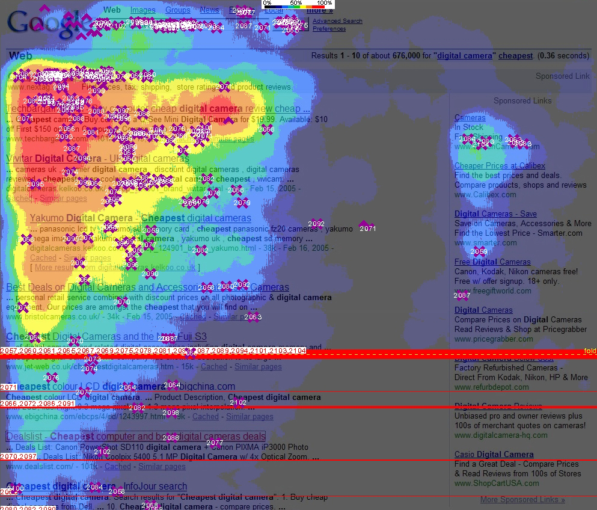
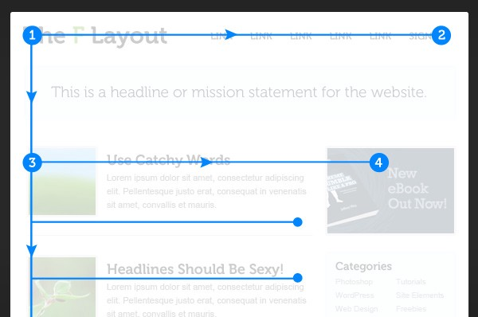

# Structuring Your Content
Structuring your content effectively is a key aspect of successful web writing. Online readers are impatient; they want to find the information they're looking for quickly. This chapter will explore strategies to organize your content for maximum impact. 

## The Power of the F-Pattern: Organizing for Online Reading 

Studies have shown that online readers tend to scan content in an "F" pattern. They first read across the top in a horizontal movement, then move down the page in a shorter horizontal sweep, and finally scan the left side vertically. Understanding this pattern allows you to place your most important information in these high-visibility areas. 

## Crafting Engaging Headlines and Subheadings 

Headlines and subheadings serve as signposts that guide readers through your content. Well-crafted headlines capture attention and provide a preview of what's to come. Subheadings break down the content into manageable sections, making it easier for readers to navigate and find the information they need. 

## Utilizing Bulleted Lists and Numbered Points 

Bulleted lists and numbered points are highly effective tools for presenting information concisely. They allow readers to absorb key details quickly, which is especially important when catering to the online reading style. Use them to highlight important information, summarize key points, and present step-by-step instructions. 