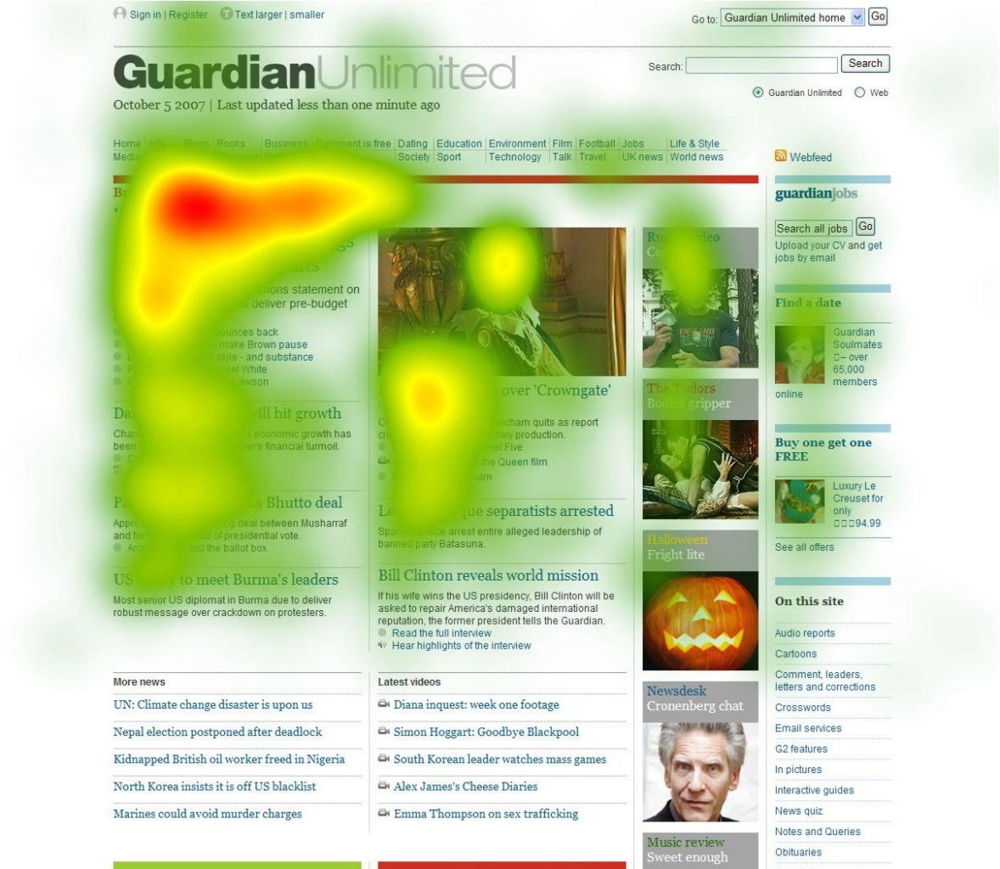

# Understanding Online Readers 

In the fast-paced digital world, understanding your online readers is crucial for effective communication. Online readers exhibit unique behavior and expectations that differ from traditional print audiences. They tend to scan content quickly, looking for information that's relevant to their needs. To capture their attention, you must adapt your writing style and presentation.  

## Scanning vs. Reading: Catering to Online Reading Habits 

Online readers rarely read every word on a webpage. Instead, they scan headings, subheadings, and bolded text to quickly assess if the content is worth their time. To accommodate this behavior, structure your content with scannability in mind. Use meaningful subheadings, bullet points, and short paragraphs to break up the text and make it easy to digest. 

## Identifying Your Target Audience 

Every piece of web content should be tailored to a specific audience. Identifying your target audience helps you determine the appropriate tone, language, and content. Conduct research to understand their demographics, interests, and pain points. This information will guide your writing and ensure your content resonates with your readers. 